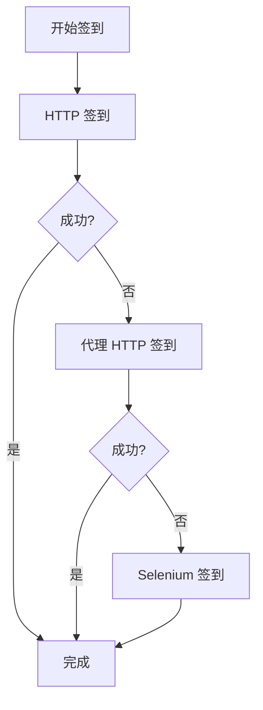

# NodeSeek 混合签到器 🚀

> **融合三个脚本优势的 GitHub Actions 优化版签到器**  
> 渐进式 Fallback: HTTP → Proxy → Selenium | 多账户批处理 | 无需验证码服务

## ✨ 特性优势

- 🎯 **渐进式签到策略**: HTTP → 代理HTTP → Selenium 三重保障
- 👥 **多账户批处理**: 支持无限制批量账户签到
- 🌐 **环境智能适配**: GitHub Actions / 青龙面板 / 本地运行
- 🔄 **Cookie 自动管理**: 支持 GitHub Variables 自动持久化
- 📊 **30天统计追踪**: 可选的签到收益统计分析
- 📢 **Telegram 通知**: Cookie过期时自动推送TG通知提醒
- 🛡️ **零依赖验证码**: 移除 YesCaptcha/CloudFreed 依赖
- ⚡ **性能优化设计**: curl_cffi 增强 Cloudflare 绕过能力

## 🚀 快速开始

### 1. Fork 本项目

点击右上角 **Fork** 按钮将项目复制到你的 GitHub 账户

### 2. 配置 GitHub Secrets 和 Variables

#### 必需的 Variables 配置

在你的仓库中：**Settings** → **Secrets and variables** → **Actions** → **Variables**

| 变量名 | 说明 | 示例 |
|--------|------|------|
| `NS_COOKIE` | NodeSeek Cookie (多账户用 `&` 分隔) | `session=abc123; smac=def456; cf_clearance=xyz...` |

#### Cookie 获取方法

1. 登录 [NodeSeek](https://www.nodeseek.com)
2. 按 `F12` 打开开发者工具
3. 切换到 **Network** 标签页
4. 刷新页面，找到任意请求
5. 在 **Request Headers** 中复制完整的 `Cookie` 值

> **💡 重要提示**: 
> - **单账户**: 直接粘贴完整 Cookie 字符串
> - **多账户**: 用 `&` 连接不同账户的完整 Cookie
> - 无需手动添加分号或格式化，直接复制浏览器中的完整字符串即可

#### 可选的 Variables 配置

| 变量名 | 说明 | 默认值 | 可选值 |
|--------|------|--------|--------|
| `PROXY_URL` | 代理服务器地址 | 空 | `http://proxy:port` |

#### 可选的 Secrets 配置

| 密钥名 | 说明 |
|--------|------|
| `TG_BOT_TOKEN` | Telegram Bot Token (用于推送签到结果和Cookie过期通知) |
| `TG_CHAT_ID` | Telegram Chat ID (接收通知的聊天ID) |

### 3. 启用 Actions

1. 进入 **Actions** 标签页
2. 点击 **"I understand my workflows, go ahead and enable them."**
3. 选择 **NodeSeek 混合签到器** workflow

### 4. 测试运行

点击 **"Run workflow"** 手动触发一次测试

---

## 🔧 高级配置

### GitHub Actions 运行参数

手动触发时可以配置以下参数：

| 参数 | 说明 | 默认值 |
|------|------|--------|
| `enable_statistics` | 是否启用30天统计 | `true` |
| `enable_selenium` | Selenium 模式 (`auto`/`true`/`false`) | `auto` |
| `random_mode` | 签到模式 (`false`=鸡腿x5, `true`=试试手气) | `true` |

### 多账户配置示例

#### 单账户配置
```bash
# 直接复制完整的 Cookie 字符串
session=a1b2c3d4e5f6g7h8; smac=987654321-XxYyZzAaBbCc; colorscheme=light; hmti_=1234567890-AbCdEfGhIjKl; cf_clearance=aBcDeFgHiJ1234567890-example-cloudflare-clearance-token
```

#### 多账户配置  
```bash
# 用 & 连接不同账户的完整 Cookie
session=a1b2c3d4e5f6g7h8; smac=987654321-XxYyZzAaBbCc; colorscheme=light; hmti_=1234567890-AbCdEfGhIjKl; cf_clearance=aBcDeFgHiJ1234567890-example1&session=x9y8z7w6v5u4t3s2; smac=123456789-DdEeFfGgHhIi; colorscheme=dark; hmti_=0987654321-MnOpQrStUvWx; cf_clearance=XyZaBcDeF9876543210-example2
```

> **⚠️ 重要**: 
> - 不要在示例中使用真实的 Cookie 值
> - 每个账户的完整 Cookie 用 `&` 分隔
> - 保持每个账户内部的分号格式不变

### Telegram Bot 通知设置

配置 Telegram Bot 可以接收**详细的签到结果报告**和Cookie过期通知：

#### 1. 创建 Telegram Bot

1. 在 Telegram 中搜索 `@BotFather`
2. 发送 `/newbot` 创建新 Bot
3. 按提示设置 Bot 名称和用户名
4. 获取 Bot Token (格式: `123456:ABC-DEF1234ghIkl-zyx57W2v1u123ew11`)

#### 2. 获取 Chat ID

**方法一 (推荐)**: 使用 @userinfobot
1. 在 Telegram 中搜索 `@userinfobot`
2. 向该 Bot 发送任意消息
3. 复制返回的 `Id` 数值

**方法二**: 通过 API 获取
1. 向你的 Bot 发送任意消息
2. 访问: `https://api.telegram.org/bot你的BOT_TOKEN/getUpdates`
3. 在返回的 JSON 中查找 `chat.id` 值

#### 3. 通知内容

配置完成后，每次签到将收到详细报告：

```
🌟 NodeSeek 签到报告
⏰ 2025-01-15 08:30:00

✅ 签到成功 (2个账户)
📱 账户1：今天已完成签到，请勿重复操作 | 30天已签到30天，平均5.1个鸡腿/天  
📱 账户2：签到成功，获得5个鸡腿

📊 统计摘要
✅ 成功：2个
❌ 失败：0个
📈 成功率：100.0%
```

当 Cookie 过期时也会收到通知，提醒及时更新。

---

## 📊 脚本架构

### 核心组件

```
NodeSeekHybridSigner (主类)
├── EnvironmentDetector (环境检测)
├── HTTPSigner (轻量级签到)
├── SeleniumSigner (终极方案)
└── StatisticsTracker (统计追踪)
```

### 渐进式签到流程



### 环境适配特性

| 环境 | 特殊优化 |
|------|----------|
| **GitHub Actions** | 自动安装 Chrome/ChromeDriver，Cookie 变量管理 |
| **青龙面板** | 兼容青龙环境变量系统 |
| **本地运行** | 支持调试模式，详细日志输出 |

---

## 🛠️ 本地开发

### 环境要求

- Python 3.8+
- Chrome 浏览器 (Selenium 需要)

### 安装依赖

```bash
pip install -r requirements.txt
```

### 环境变量配置

```bash
# 必需
export NS_COOKIE="你的cookie"

# 可选
export PROXY_URL="http://proxy:port"
export ENABLE_STATISTICS="true"
export ENABLE_SELENIUM="auto"
export NS_RANDOM="true"
export HEADLESS="false"  # 本地调试可设为 false 查看浏览器
```

### 运行脚本

```bash
python nodeseek_hybrid.py
```

---

## 📝 日志说明

### 日志级别

- ✅ **INFO**: 正常签到状态
- ⚠️ **WARNING**: 非致命错误 
- ❌ **ERROR**: 严重错误
- 🔍 **DEBUG**: 调试信息

### 常见日志消息

| 消息 | 含义 | 处理建议 |
|------|------|----------|
| `✅ HTTP 签到成功` | HTTP 方式签到成功 | 无需处理 |
| `⚠️ HTTP 签到失败` | HTTP 方式失败，尝试其他方式 | 观察后续方法是否成功 |
| `❌ 所有签到方法都失败` | 全部方法失败 | 检查 Cookie 是否过期 |
| `🔐 Selenium 登录成功` | Selenium 成功验证登录 | 无需处理 |
| `🚨 检测到Cookie过期` | 发现Cookie已过期 | 手动更新相应账户Cookie |
| `✅ TG消息发送成功` | Telegram通知发送成功 | 无需处理 |
| `⚠️ TG通知发送失败` | Telegram推送失败 | 检查TG配置是否正确 |

---

## 🔍 故障排除

### Cookie 相关

**问题**: `❌ 未找到任何账户配置`
**解决**: 检查 `NS_COOKIE` 变量是否正确设置

**问题**: `❌ 所有签到方法都失败，建议手动更新 Cookie`
**解决**: Cookie 可能已过期，需要重新获取

### GitHub Actions 相关

**问题**: Actions 运行失败
**解决**: 
1. 检查 Variables 配置是否正确
2. 查看 Actions 日志中的具体错误信息
3. 确认仓库已启用 Actions

**问题**: Cookie 过期通知
**解决**: 检查 `TG_BOT_TOKEN` 和 `TG_CHAT_ID` 是否正确配置

---

## 🤝 贡献指南

欢迎提交 Issue 和 Pull Request！

### 开发规范

1. 代码风格: 遵循 PEP 8
2. 提交信息: 使用清楚的中文描述
3. 测试: 确保新功能经过测试

---

## 📄 许可证

本项目采用 MIT 许可证 - 查看 [LICENSE](LICENSE) 文件了解详情

---

## 🙏 致谢

本项目融合了多个 NodeSeek 签到脚本的优势：
- 基于社区现有的 NodeSeek 签到脚本
- 感谢所有贡献者的努力

---

## ⚠️ 免责声明

- 本工具仅用于学习和研究目的
- 使用本工具所产生的任何后果由使用者自行承担
- 请遵守 NodeSeek 网站的使用条款和服务协议

---

<div align="center">

**如果这个项目对你有帮助，请给个 ⭐ Star 支持一下！**

</div>