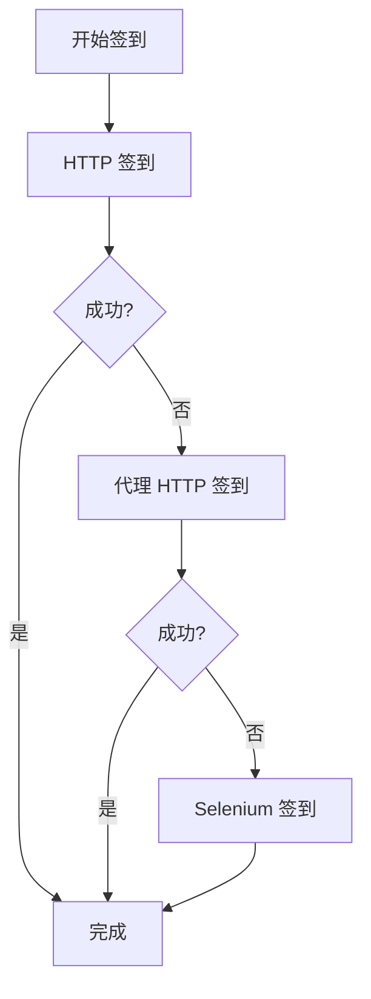

# NodeSeek 混合签到器 🚀

> **融合三个脚本优势的 GitHub Actions 优化版签到器**  
> 渐进式 Fallback: HTTP → Proxy → Selenium | 多账户批处理 | 无需验证码服务

## ✨ 特性优势

- 🎯 **渐进式签到策略**: HTTP → 代理HTTP → Selenium 三重保障
- 👥 **多账户批处理**: 支持无限制批量账户签到
- 🌐 **环境智能适配**: GitHub Actions / 青龙面板 / 本地运行
- 🔄 **Cookie 自动管理**: 支持 GitHub Variables 自动持久化
- 📊 **30天统计追踪**: 可选的签到收益统计分析
- 🛡️ **零依赖验证码**: 移除 YesCaptcha/CloudFreed 依赖
- ⚡ **性能优化设计**: curl_cffi 增强 Cloudflare 绕过能力

## 🚀 快速开始

### 1. Fork 本项目

点击右上角 **Fork** 按钮将项目复制到你的 GitHub 账户

### 2. 配置 GitHub Secrets 和 Variables

#### 必需的 Variables 配置

在你的仓库中：**Settings** → **Secrets and variables** → **Actions** → **Variables**

| 变量名 | 说明 | 示例 |
|--------|------|------|
| `NS_COOKIE` | NodeSeek Cookie (多账户用 `&` 分隔) | `session=abc123; smac=def456&session=ghi789; smac=jkl012` |

#### Cookie 获取方法

1. 登录 [NodeSeek](https://www.nodeseek.com)
2. 按 `F12` 打开开发者工具
3. 切换到 **Network** 标签页
4. 刷新页面，找到任意请求
5. 在 **Request Headers** 中复制完整的 `Cookie` 值

#### 可选的 Variables 配置

| 变量名 | 说明 | 默认值 | 可选值 |
|--------|------|--------|--------|
| `PROXY_URL` | 代理服务器地址 | 空 | `http://proxy:port` |

#### 可选的 Secrets 配置

| 密钥名 | 说明 |
|--------|------|
| `GH_PAT` | GitHub Personal Access Token (用于 Cookie 自动更新) |

### 3. 启用 Actions

1. 进入 **Actions** 标签页
2. 点击 **"I understand my workflows, go ahead and enable them."**
3. 选择 **NodeSeek 混合签到器** workflow

### 4. 测试运行

点击 **"Run workflow"** 手动触发一次测试

---

## 🔧 高级配置

### GitHub Actions 运行参数

手动触发时可以配置以下参数：

| 参数 | 说明 | 默认值 |
|------|------|--------|
| `enable_statistics` | 是否启用30天统计 | `true` |
| `enable_selenium` | Selenium 模式 (`auto`/`true`/`false`) | `auto` |
| `random_mode` | 签到模式 (`false`=鸡腿x5, `true`=试试手气) | `true` |

### 多账户配置示例

```bash
# 账户1
session=232d19a2b6de92013fbf57f6f454a973; smac=1751693002-Q3I8vle80Co1dHjX65C9YvlP0X3jfdBcdLGUffVWbnM; cf_clearance=xJV0806yEMy...

# 多账户 (用 & 分隔)
session=账户1cookie; smac=账户1值&session=账户2cookie; smac=账户2值
```

### 自动 Cookie 更新设置

如果希望脚本能自动更新过期的 Cookie，需要配置 GitHub Personal Access Token：

1. 创建 PAT: **Settings** → **Developer settings** → **Personal access tokens** → **Tokens (classic)**
2. 选择权限: `repo` (完整仓库访问权限)
3. 将 Token 添加到 **Secrets** 中，命名为 `GH_PAT`

---

## 📊 脚本架构

### 核心组件

```
NodeSeekHybridSigner (主类)
├── EnvironmentDetector (环境检测)
├── GitHubVariableManager (变量管理)
├── HTTPSigner (轻量级签到)
├── SeleniumSigner (终极方案)
└── StatisticsTracker (统计追踪)
```

### 渐进式签到流程



### 环境适配特性

| 环境 | 特殊优化 |
|------|----------|
| **GitHub Actions** | 自动安装 Chrome/ChromeDriver，Cookie 变量管理 |
| **青龙面板** | 兼容青龙环境变量系统 |
| **本地运行** | 支持调试模式，详细日志输出 |

---

## 🛠️ 本地开发

### 环境要求

- Python 3.8+
- Chrome 浏览器 (Selenium 需要)

### 安装依赖

```bash
pip install -r requirements.txt
```

### 环境变量配置

```bash
# 必需
export NS_COOKIE="你的cookie"

# 可选
export PROXY_URL="http://proxy:port"
export ENABLE_STATISTICS="true"
export ENABLE_SELENIUM="auto"
export NS_RANDOM="true"
export HEADLESS="false"  # 本地调试可设为 false 查看浏览器
```

### 运行脚本

```bash
python nodeseek_hybrid.py
```

---

## 📝 日志说明

### 日志级别

- ✅ **INFO**: 正常签到状态
- ⚠️ **WARNING**: 非致命错误 
- ❌ **ERROR**: 严重错误
- 🔍 **DEBUG**: 调试信息

### 常见日志消息

| 消息 | 含义 | 处理建议 |
|------|------|----------|
| `✅ HTTP 签到成功` | HTTP 方式签到成功 | 无需处理 |
| `⚠️ HTTP 签到失败` | HTTP 方式失败，尝试其他方式 | 观察后续方法是否成功 |
| `❌ 所有签到方法都失败` | 全部方法失败 | 检查 Cookie 是否过期 |
| `🔐 Selenium 登录成功` | Selenium 成功验证登录 | 无需处理 |

---

## 🔍 故障排除

### Cookie 相关

**问题**: `❌ 未找到任何账户配置`
**解决**: 检查 `NS_COOKIE` 变量是否正确设置

**问题**: `❌ 所有签到方法都失败，建议手动更新 Cookie`
**解决**: Cookie 可能已过期，需要重新获取

### GitHub Actions 相关

**问题**: Actions 运行失败
**解决**: 
1. 检查 Variables 配置是否正确
2. 查看 Actions 日志中的具体错误信息
3. 确认仓库已启用 Actions

**问题**: Cookie 自动更新失败
**解决**: 检查 `GH_PAT` 是否正确配置且有足够权限

---

## 🤝 贡献指南

欢迎提交 Issue 和 Pull Request！

### 开发规范

1. 代码风格: 遵循 PEP 8
2. 提交信息: 使用清楚的中文描述
3. 测试: 确保新功能经过测试

---

## 📄 许可证

本项目采用 MIT 许可证 - 查看 [LICENSE](LICENSE) 文件了解详情

---

## 🙏 致谢

本项目融合了多个 NodeSeek 签到脚本的优势：
- 基于社区现有的 NodeSeek 签到脚本
- 感谢所有贡献者的努力

---

## ⚠️ 免责声明

- 本工具仅用于学习和研究目的
- 使用本工具所产生的任何后果由使用者自行承担
- 请遵守 NodeSeek 网站的使用条款和服务协议

---

<div align="center">

**如果这个项目对你有帮助，请给个 ⭐ Star 支持一下！**

</div>